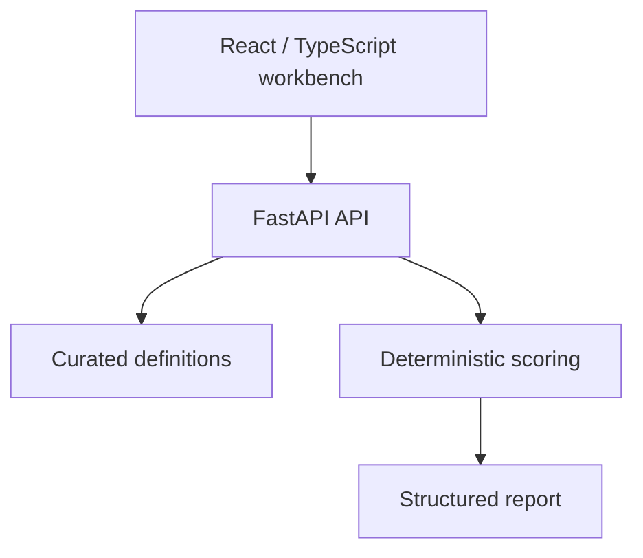
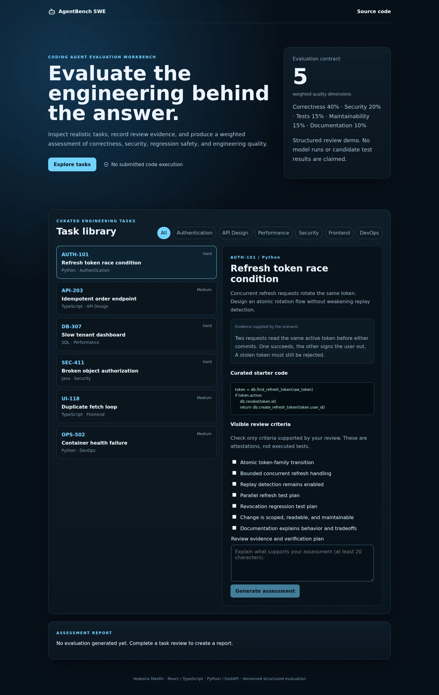

# AgentBench SWE

A versioned review workbench for evaluating coding-agent solutions across correctness, security, regression safety, and engineering quality.

[](https://github.com/yeabsira-mesfin/WeatherForecast/actions)

**Demo status:** public hosting is pending account permissions. No live URL is claimed. Run the local demo below. Intended repository slug: `agentbench-swe`; GitHub repository renaming is pending.

## Why this exists

A compiling patch can still break authorization or introduce a regression. This project makes the review criteria, weighting, evidence, and release gates explicit so an evaluator can explain their judgment.

## Important features

- Six curated tasks covering authentication, API design, SQL performance, Java authorization, React effects, and deployment readiness.
- Five task-specific visible criteria per task and a versioned five-dimension rubric.
- Server-only structural security and regression gates, separate from the numeric score.
- Reviewer evidence captured in a downloadable JSON report.
- Bounded, validated requests; no code upload, shell execution, or model API requirement.
- Existing `/evaluate` numeric scoring contract preserved.

## Architecture

The React client calls a stateless scoring API. Curated task/rule definitions and score policies live in the backend. Production requests use the same-origin API by default; local development defaults to the backend port. No database, credential, or paid AI API is needed.



## Technology stack

React, TypeScript, Vite, Python 3.12, FastAPI, Pydantic, pytest, Docker, GitHub Actions.

## Evaluation methodology

This is a **reviewer-attested structured evaluation**, not an autonomous agent runner. An evaluator inspects a proposed solution outside the demo and marks only criteria supported by evidence. Correctness averages the first two criteria; security uses the security criterion; test quality averages the verification and regression criteria; maintainability and documentation are explicit reviewer attestations.

`total = 0.40 correctness + 0.20 security + 0.15 tests + 0.15 maintainability + 0.10 documentation`

Release readiness additionally requires both correctness criteria, the security criterion, and the regression criterion. A high numeric score can fail a release gate. The gate policy lives on the server, but **it is not a hidden executable test suite**. Visible and held-out executable candidate tests are a future extension requiring disposable isolation. Current pytest tests verify the evaluation contract itself. No real model comparison, pass rate, runtime, or candidate test count is reported.

## Example

```bash
curl http://localhost:8000/api/evaluate -H 'Content-Type: application/json' -d '{"task_id":"AUTH-101","satisfied_checks":["c0","c1","c3","c4"],"explanation":"Atomic rotation reviewed; replay detection remains unsupported.","maintainability":true,"documentation":true}'
```
This input deterministically scores 80/100 and fails the security release gate. That score describes the submitted attestations, not measured agent performance.

## Security considerations

- Submitted content is treated as data. There is no `eval`, shell execution of submissions, arbitrary repository checkout, or candidate code execution.
- Requests are bounded and validated; UI requests time out and surface errors.
- APIs are public, stateless demonstration endpoints. CORS permits configured origins, but CORS is not authentication. Configure `ALLOWED_ORIGINS` as a comma-separated list of exact frontend origins for cross-origin hosting.
- No secrets are required. `VITE_` variables are public bundle contents; use `VITE_API_BASE_URL` only for an API URL.
- Do not submit private code, customer data, or real credentials. The application does not intentionally persist submissions, but hosting providers can retain request/access metadata.
- Hosting-level rate limits and abuse controls are needed before wider public traffic. Future executable evaluation must use disposable, isolated environments with resource limits, restricted networking, and no production credentials. The ordinary application Dockerfiles are not an untrusted-code sandbox.

## Project structure

```text
frontend/src/App.tsx       Task review UI and JSON export
frontend/src/api.ts        Typed requests and timeouts
backend/app/tasks.py       Versioned curated task definitions
backend/app/evaluator.py   Weighted score engine
backend/app/main.py        Validated API and structural gates
backend/tests/            Evaluator and API contract tests
.github/workflows/ci.yml   Build and backend tests
vercel.json               Frontend/backend service routing
docker-compose.yml       Local same-origin demo
```

## Local setup

Requirements: Node.js 22, Python 3.12. Start backend and frontend in separate terminals.

```bash
cd backend
python -m venv .venv
source .venv/bin/activate
pip install -r requirements.txt
uvicorn app.main:app --reload --port 8000
```

```bash
cd frontend
npm ci
npm run dev
```

Open `http://localhost:5173`. The API listens at `http://localhost:8000`. If overriding the API location, copy `frontend/.env.example` to `frontend/.env.local` and set `VITE_API_BASE_URL`. Restart Vite after changing it.

For the same-origin Docker demo:

```bash
docker compose up --build
```

Open `http://localhost:5173`. Nginx proxies API requests to the backend and serves SPA deep links. Docker configuration is provided; consult the QA notes for whether a container build was actually run.

## Testing

```bash
cd frontend
npm ci
npm run build   # includes strict TypeScript checking
```

```bash
cd backend
PYTHONPATH=. python -m pytest
```

[QA notes](docs/QA.md) record actual checks and limitations. CI installs from committed npm lockfiles. Test results are software verification, not benchmark/model evaluation data.

## Deployment

**Vercel:** import this repository with the repository root selected. `vercel.json` defines the React frontend plus the existing backend as separate services. Services are currently Beta. The Java backend uses a container runtime; the other projects retain FastAPI or Express. API routes precede the frontend catch-all. Production defaults to a same-origin API, avoiding cross-origin configuration and localhost leakage. If deploying the frontend alone, select `frontend` as root and set `VITE_API_BASE_URL` to the deployed API origin before building.

**Alternative API hosting:** use the backend Dockerfile on a provider supporting that runtime, such as Render. Set `ALLOWED_ORIGINS` to the exact frontend URL and set the frontend public API origin. RepoDoctor accepts `PORT`; use the Dockerfile's documented port for Python/Node deployments or override the startup command.

**GitHub Pages:** Pages can host only the static React frontend, not Python/Node/Java APIs. A manual Pages workflow is included. Enable Pages with GitHub Actions in repository settings, configure repository variable `PUBLIC_API_BASE_URL` with the hosted API origin, and run the workflow. The build derives its base path from the repository name so renamed repositories retain working assets. Without a hosted API it cannot provide the interactive evaluator.

Free-tier terms are time-sensitive. Current official references: [Vercel Hobby](https://vercel.com/docs/plans/hobby), [Vercel Services pricing](https://vercel.com/docs/services/pricing), [Render free services](https://render.com/docs/free), and [GitHub Pages limits](https://docs.github.com/en/pages/getting-started-with-github-pages/github-pages-limits). Hobby has usage caps and personal/noncommercial restrictions. Render free web services have sleep/usage limits. No provider is claimed to be permanently free.

## Screenshots and demo

Actual screenshots from the production build running locally against its backend:



[Mobile screenshot](docs/screenshots/mobile.webp) · [QA notes](docs/QA.md)

These show curated fixture evaluations, not measured model performance. Public hosting remains pending.

## What this demonstrates professionally

AI evaluation design, explicit rubrics, review evidence, safe public demonstration boundaries, Python APIs, React/TypeScript, automated validation, and CI/CD configuration.

## Limitations

Manual attestations cannot prove a patch works. No candidate code is executed, no agent integration or independent held-out candidate tests exist, and reports are not persisted.

## Author

**Yeabsira Mesfin**
Full Stack Software Engineer · M.S. Cybersecurity in Computer Science student
